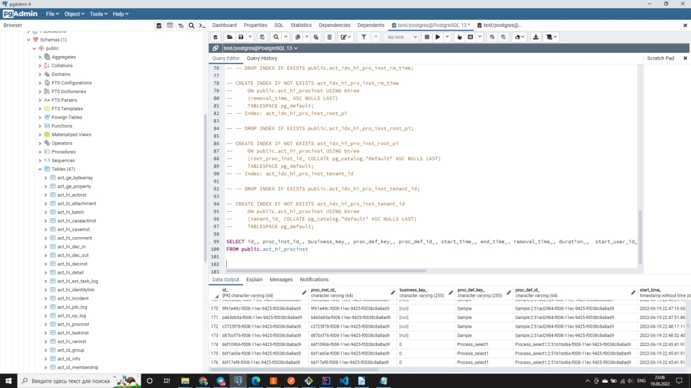

# CK2DFTP12-1164

Замер производительности  (delegates):

			SELECT id_, proc_inst_id_, business_key_, proc_def_key_, proc_def_id_, start_time_, end_time_, 
			removal_time_, duration_,  start_user_id_, start_act_id_, end_act_id_, super_process_instance_id_, 
			root_proc_inst_id_, super_case_instance_id_, case_inst_id_, delete_reason_, tenant_id_, state_
			FROM public.act_hi_procinst

			SELECT min(start_time_), max(end_time_), min(end_time_ - start_time_), max(end_time_ - start_time_), avg(end_time_ - start_time_)
			FROM public.act_hi_procinst 
			WHERE end_time_ < '2022-06-19 23:11:16.441'
			-- GROUP BY (end_time_ - start_time_) 
			limit  100

| min_time  | max_time | min_interval | max_interval | avg_interval |
| ------------- | ------------- | ------------- | ------------- | ------------- |
| 2022-06-19 22:39:09.03  | 2022-06-19 23:11:16.385  | 00:00:00.059 | 00:00:03.517  | 00:00:01.050184  | 
